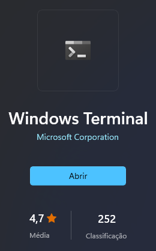
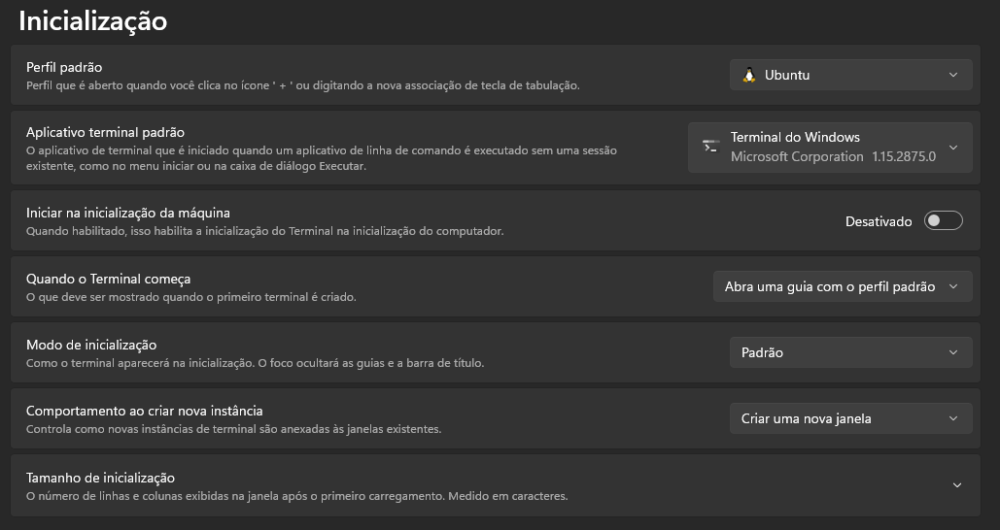
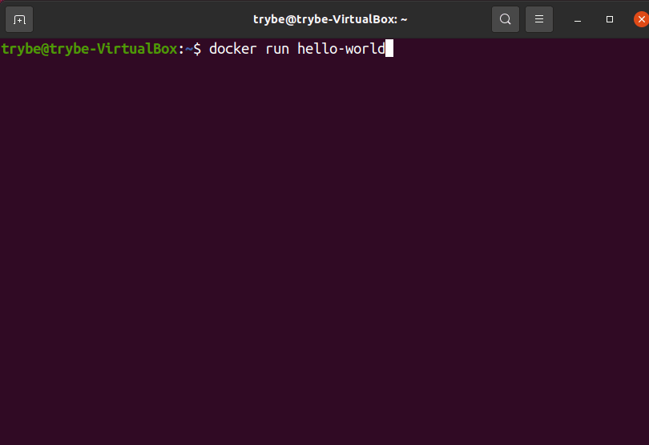

# WSL2

Resumo de instalação WSL2 no windows e dependencias da trybe e github.

<details>
<summary><strong>🪟 Passo 1 - Instalação WSL2</strong></summary><br>

<strong>1º Abra o Windows PowerShell como ADM e execute o comando:</strong>

```wsl
wsl --install
```

- caso não funcione veja este passo a passo https://learn.microsoft.com/pt-br/windows/wsl/install-manual

<br />
<strong>2º Enquanto instala o WSL abra o Microsoft Store e procure pelo aplicativo:</strong>

```terminal
Windows terminal
```

  <details>
    <summary>Imagem do aplicativo - Windows terminal</summary><br>
    
  </details>

- Em seguida instale o aplicativo Windows terminal

<br />
<strong>3º Quando o WSL for instalado reinicie o computador!</strong>

<br />
<strong>4º Após reiniciar vai aparecer um terminal pedindo para criar um usuario linux, você digita o nome do usuario e a senha para criar, e pronto você já esta com o linux instalado via WSL.</strong>

</details>

<details>
<summary><strong>💻 Passo 2 - Configuração do Terminal</strong></summary><br>

<strong>1º Abra o Windows terminal, digitando na barra de pesquisa do windows - "Terminal".</strong>

<br />
<strong>2º Va nas configurações e deixe igual a imagem abaixo</strong>

- Em inicialização



</details>

<details>
<summary><strong>💚 Passo 3 - Instalação do Oh My Zsh </strong></summary><br>

<strong>1º Abra o terminal do Ubuntu e instale o zsh:</strong>

```zsh
sudo apt-get install zsh
```

<br />
<strong>2º Feche o terminal e abra um novo terminal e instale o Oh My Zsh:</strong>

- wget

```wget
install wget
```

```my zsh
sh -c "$(wget -O- https://raw.githubusercontent.com/ohmyzsh/ohmyzsh/master/tools/install.sh)"
```

</details>

<details>
<summary><strong>📇 Passo 4 - Instalação do vscode com code .</strong></summary><br>

<br />
<strong>1º Abra o Microsoft Store e procure por vscode:</strong>

- OBS: "A instalação tem que ser pela Microsoft Store"

<strong>2º Abra um novo terminal do Ubunto e digite o comando abaixo para abrir o vscode da pasta atual:</strong>

```code
code .
```

</details>

<details>
<summary><strong>📗 Passo 5 - Instalação do Node com NVM</strong></summary><br>

<strong>1º Abra o terminal do Ubunto e digite o comando abaixo para instalar o NVM:</strong>

```nvm
wget -qO- https://raw.githubusercontent.com/nvm-sh/nvm/v0.39.2/install.sh | bash
```

<br />
<strong>2º Abra uma nova janela do terminal para utilizar os comandos do NVM e digite o comando abaixo para instalar a versão mais atual do node;</strong>

```node atual
nvm install lts/
```

<br />
<strong>3º Em seguida para instalar a versão do node para os projetos da trybe digite o comando abaixo:</strong>

```node v16
nvm install 16
```

</details>

<details>
<summary><strong>🔑 Passo 6 - Instalação da chave ssh </strong></summary><br>

<strong>1º Abra o terminal do Ubunto e digite o comando abaixo para instalar uma nova chave publica:</strong>

- OBS: onde está escrito "your_email@example.com" é para digitar seu email do github.

```criando key
ssh-keygen -t ed25519 -C "your_email@example.com"
```

- ENTER;
- DIGITE UMA SENHA QUE VOCÊ LEMBRE;
- DIGITE A SENHA NOVAMENTE NOVAMENTE;

<br />
<strong>2º Agora vamos adicionar a chave criada para o github, no terminal digite o comando abaixo para copiar a chave pública SSH para sua área de transferência.</strong>

```chave pub
cat ~/.ssh/id_ed25519.pub
```

<br />
3º No canto superior direito de qualquer página do github, clique na foto do seu perfil e em Configurações.


<br />
<strong>4º Na seção "Access" da barra lateral, clique nas SSH and GPG keys.</strong>

<br />
<strong>5º Clique em New SSH key.</strong>


<br />
<strong>6º Adicione um titulo para sua chave.</strong>

<br />
<strong>7º Cole sua chave no campo "Key".</strong>


<br />
<strong>8º Clique em Add SSH key.</strong>


</details>

<details>
<summary><strong>🌎 Passo 7 - Instalação google chrome no linux</strong></summary><br>

<strong>1º Abra o terminal do Ubunto e digite o comando abaixo para instalar o google chrome:</strong>

```baixar chrome
wget https://dl.google.com/linux/direct/google-chrome-stable_current_amd64.deb
```

<br />
<strong>2º Instale o pacote do Chrome baixado anteriormente.</strong>

```
sudo dpkg -i google-chrome-stable_current_amd64.deb
```

<br />
<strong>3º Corrija os erros de instalação do Chrome.</strong>

```
sudo apt-get install -f
```

<br />
<strong>4º Digite "google-chrome" e pressione a tecla ↵ Enter para abrir o Chrome.</strong>

</details>

<details>
<summary><strong>🛄 Passo 8 - Instalação do docker</strong></summary><br>

<strong>1º Desinstale versões anteriores</strong>

```
sudo apt update && sudo apt upgrade
```

```
sudo apt-get remove docker containerd runc
```

<br />
<strong>2º Instalando as dependências iniciais</strong>

```
sudo apt-get install \
    apt-transport-https \
    ca-certificates \
    curl \
    gnupg \
    lsb-release
```

<br />
<strong>3º Adicionando a chave pública do repositório Docker em nossa máquina</strong>

```
curl -fsSL https://download.docker.com/linux/ubuntu/gpg | sudo gpg --dearmor -o /usr/share/keyrings/docker-archive-keyring.gpg
```

<br />
<strong>4º Adicionando o repositório remoto na lista do apt</strong>

```
echo \
  "deb [arch=amd64 signed-by=/usr/share/keyrings/docker-archive-keyring.gpg] https://download.docker.com/linux/ubuntu $(lsb_release -cs) stable" \
  | sudo tee /etc/apt/sources.list.d/docker.list > /dev/null
```

<br />
<strong>5º Instalando o Docker no Linux</strong>

```
sudo apt update && sudo apt upgrade
```

```
sudo apt-get install docker-ce docker-ce-cli containerd.io
```

<br />
<strong>6º Adicionando seu usuário ao grupo de usuários Docker</strong>

```
sudo groupadd docker
```

```
sudo usermod -aG docker $USER
```

- ⚠️ Execute o comando exatamente como ele está acima, considerando as letras maiúsculas e minúsculas.

```
newgrp docker
```

- ⚠️ Se após esse comando você tiver algum problema, reinicie sua máquina. Depois de reiniciar siga para os próximos passos

<br />
<strong>8º Inicie o Daemon do Docker</strong>

- Para consultar o status atual do daemon do Docker, execute o seguinte comando:

```
sudo service docker status
```

- Caso apareca Docker is not running

```
sudo service docker start
```

<br />
<strong>9º Valide a instalação</strong>

```
docker run hello-world
```



</details>
